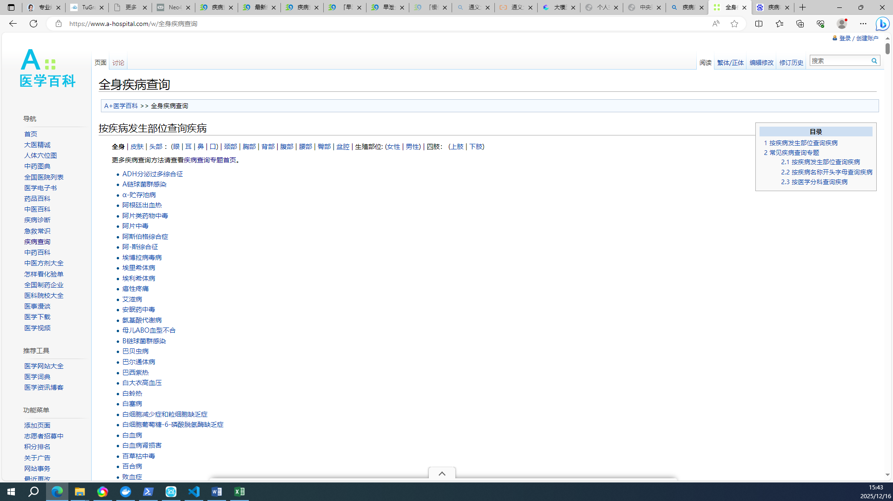
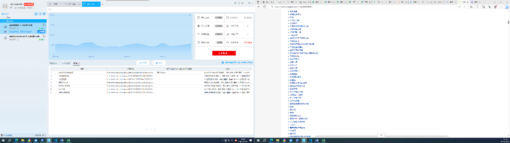
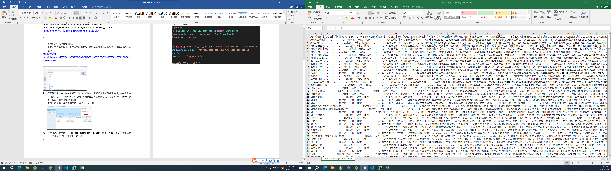
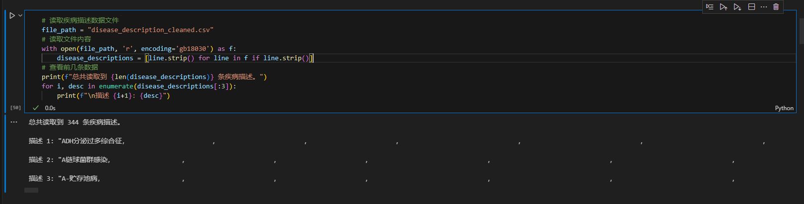
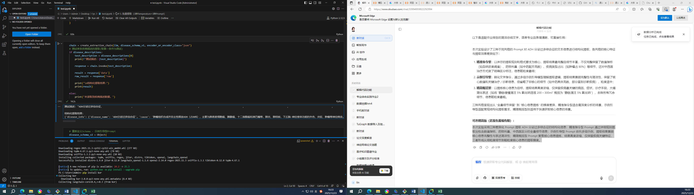
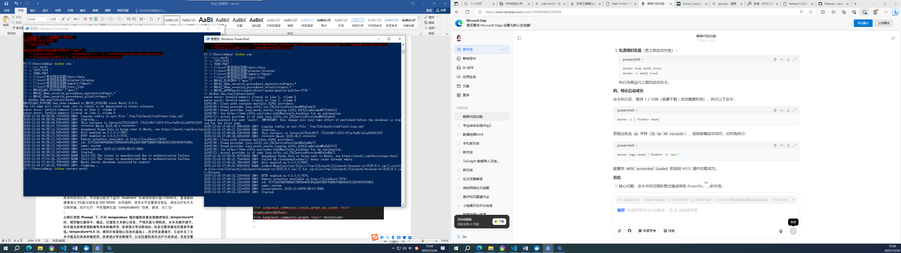
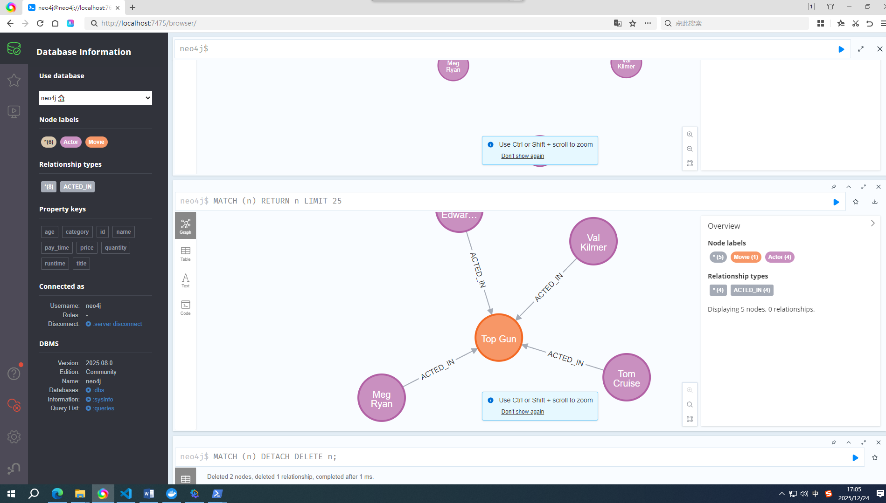

# LLM-tool-in-graph
## 作业三-2022310943-林雨珊

### 作业要求
文本型疾病描述数据的获取-6分

使用大模型工具提取疾病结构化数据，要求测试3种不同temperature值、3种不同prompt的提取效果-6分

调试成功Neo4j与大模型的接口，实现自然语言与Cypher语句的转化功能，展示运行成功截图-6分

在TuGraph平台的图数据库上接入大模型Cypher语句的生成-6分

提交csdn/github网页链接或将网页输出成pdf提交-6分

参考网站：https://python.langchain.ac.cn/docs/integrations/chat/openai/ 
https://www.langchain.com.cn/docs/integrations/graphs/neo4j_cypher/ 
https://github.com/TuGraph-family/Awesome-Text2GQL

### 一、文本型疾病描述数据的获取
#### 1.	下载安装后羿采集器，用于网页数据爬取
选取的全身疾病查询列表进行数据爬取，网址为https://www.a-hospital.com/w/%E5%85%A8%E8%BA%AB%E7%96%BE%E7%97%85%E6%9F%A5%E8%AF%A2
爬取页面如下图所示


#### 2. 打开后羿采集器，选择智能采集
粘贴上述网址，智能识别完成后新建字段，选择插入疾病简介一栏中的“详情”url，进入新的详情界面后再次新建字段，命名为description，选中疾病简介的全部文字内容即可。点击开始采集，等待采集完成，导出为csv文件。
采集中的截图如下图所示


#### 3. 数据描述
经过清洗后数据命名为“disease_description_cleaned”，数据无title，共344条疾病描述，平均每条描述5600字。
如图所示


### 二、连接大模型工具提取结构化数据
#### 1. 安装环境依赖,并获取大模型额度
```bash
pip install langchain_openai kor
```
选择使用阿里云的通义千问，注册完成后，先开通阿里云百炼的模型服务，之后进行实名认证，领取免费额度，然后申请api_key，复制即可。
```python
from langchain_openai import ChatOpenAI

llm = ChatOpenAI(
    model="qwen-plus",
    temperature=0,
    base_url="https://dashscope.aliyuncs.com/compatible-mode/v1",
    api_key="sk-0d21fc42e32f40f8a6d4270342f86a03")

from kor.extraction import create_extraction_chain
from kor.nodes import Object, Text, Number

```
 #### 2.测试3种不同temperature值和prompt的提取效果 
 ##### （1） 读取疾病描述文件
```python
# 读取疾病描述数据文件
file_path = "disease_description_cleaned.csv"  
# 读取文件内容
with open(file_path, 'r', encoding='gb18030') as f:  
    disease_descriptions = [line.strip() for line in f if line.strip()]
# 查看前几条数据
print(f"总共读取到 {len(disease_descriptions)} 条疾病描述。")
for i, desc in enumerate(disease_descriptions[:3]):  
    print(f"\n描述 {i+1}: {desc}")

```
成功读取如下图显示


##### （2） 定义schema-尝试3种prompt
###### Prompt风格1：精准指令型
特点：字段描述极度详细，明确要求提取粒度和格式，适合需要精准、无遗漏提取的场景。
部分定义示例如下：
```python
id="disease_info",
    description="【精准提取要求】从疾病描述文本中提取结构化信息，要求：1. 所有数值指标（如血钠浓度）必须保留；2. 多个同类信息用中文逗号分隔；3. 仅提取文本中明确提及的信息，不编造；4. 中西医治疗需分开标注。",
    attributes=[
        Text(
            id="disease_name",
            description="疾病的标准名称，需包含英文缩写（如有），例如：ADH分泌过多综合征、荨麻疹(Urticaria)。"
        ),
        Text(
            id="cause",
            description="疾病的直接病因，需列出所有明确提及的病因类型，包括百分比、具体疾病/组织名称，例如：肿瘤组织合成并自主性释放ADH（占80%），肺炎、肺结核。"
        )
    ]
```
###### Prompt风格2：示例引导型
特点：减少文字指令，通过多组示例引导模型理解提取逻辑，适合示例丰富、指令不宜过长的场景。
部分定义示例如下：
```python
id="disease_info",
    description="从疾病描述文本中提取结构化信息，参考以下示例的提取风格和粒度。",
    attributes=[
        Text(
            id="disease_name",
            description="疾病名称",
            examples=[
                ("ADH分泌过多综合征的症状包括低钠血症", "ADH分泌过多综合征"),
                ("荨麻疹(Urticaria)表现为风团", "荨麻疹(Urticaria)")
            ]
        ),
        Text(
            id="cause",
            description="疾病病因",
            examples=[
                ("肿瘤释放ADH占80%，肺炎也会引发", "肿瘤组织合成并自主性释放ADH（80%），肺炎"),
                ("白癜风与自身免疫、遗传有关", "自身免疫异常，遗传因素")
            ]
        )
    ]
```
###### Prompt风格3：精简概括型
特点：指令和描述极简，要求模型提炼核心信息，适合需要简洁结果、去除冗余的场景。
部分定义示例如下：
```python
id="disease_info",
    description="提取疾病核心信息，仅保留关键内容，精简表述，避免冗余。",
    attributes=[
        Text(id="disease_name", description="疾病名称"),
        Text(id="cause", description="核心病因"),
        Text(id="symptoms", description="核心症状"),
        Text(id="diagnosis", description="核心诊断方法"),
        Text(id="treatment", description="核心治疗方法"),
        Text(id="complications", description="核心并发症")
    ],
    examples=[
        (
            "ADH分泌过多综合征是因肿瘤释放ADH（80%）导致水排泄障碍，血钠<130mmol/L时无力，<110mmol/L时昏迷死亡；诊断查尿钠>20mmol/L；治疗限水<100ml/天，滴注5%氯化钠，中药健脾化湿。",
            {
                "disease_name": "ADH分泌过多综合征",
                "cause": "肿瘤释放ADH",
                "symptoms": "低钠血症，昏迷，死亡",
                "diagnosis": "查血钠/尿钠",
                "treatment": "限水，补钠，中药",
                "complications": "昏迷，死亡"
            }
        )
]
```
##### （3） 测试3种prompts的提取效果
取第一条作为测试，进行单条疾病描述的结构化提取，代码如下（以第一种风格disease_schema_v1为例）：
```python
chain = create_extraction_chain(llm, disease_schema_v1, encoder_or_encoder_class="json")
# 测试单条疾病描述的提取(取第一条作为测试)
if disease_descriptions:  
    test_description = disease_descriptions[0] 
    print(f"测试描述: {test_description}")

    response = chain.invoke(test_description)
    
    result = response['data']  
    raw_result = response['raw']  

    print("\n结构化提取结果:")
    print(result)
    
else:
    print("未读取到疾病描述数据。")
```
运行成功截图：


###### 三种prompts的提取结果如下：
- **风格1（精准指令型）:**
{'disease_info': {'disease_name': 'ADH分泌过多综合征', 'cause': '肿瘤组织合成并自主性释放ADH（占80%），主要为肺燕麦细胞癌、胰腺癌、十二指肠癌和淋巴瘤等，肺炎、肺结核，下丘脑-神经垂体功能的外伤、炎症、肿瘤等神经病变。', 'symptoms': '水潴留，低钠血症（血清钠<130mmol/L），无力、食欲不振、恶心呕吐、嗜睡、烦躁、精神失常（血钠<120mmol/L），惊厥、昏迷、死亡（血钠<110mmol/L）。', 'diagnosis': '查血钠（<130mmol/L）、查尿钠（>20mmol/L），尿渗透压高于血浆渗透压，与肾小管病变、肾上腺皮质功能低下、慢性心衰、肝硬化腹水、高渗利尿剂应用、甲状腺功能低下鉴别。', 'treatment': '西医：限制摄水量<100ml/天，静脉缓慢滴注5%氯化钠溶液200～300ml，加用速尿，去甲金霉素或锂盐，手术切除肿瘤，放疗化疗；中医：健脾化湿，调理脾胃（嫩苏梗9克，制厚朴10克，广陈皮6克，炒白术6克，知母9克，茯苓9克，抽葫芦10克，炒枳壳9克，麦冬9克，猪苓9克，泽泻9克，甘草6克）。', 'complications': '惊厥，昏迷，死亡（重度）。'}}
- **风格2（示例引导型）:**
{'disease_info': {'disease_name': 'ADH分泌过多综合征', 'cause': '肿瘤组织合成并自主性释放ADH（80%），肺炎、肺结核，下丘脑-神经垂体功能的外伤、炎症、肿瘤', 'symptoms': '水潴留，低钠血症（<130mmol/L），无力，食欲不振，恶心呕吐，嗜睡，烦躁，惊厥，昏迷，死亡', 'diagnosis': '查血钠（<130mmol/L），尿钠（>20mmol/L），与肾小管病变、肾上腺皮质功能低下鉴别', 'treatment': '限制摄水量<100ml/天，静脉滴注5%氯化钠溶液200-300ml，使用速尿，去甲金霉素，手术切除肿瘤，放疗化疗，中药健脾化湿', 'complications': '惊厥，昏迷，死亡'}}
- **风格3（精简概括型）:**
{'disease_info': {'disease_name': 'ADH分泌过多综合征', 'cause': '肿瘤组织合成并自主性释放ADH，肺炎、肺结核、神经病变等', 'symptoms': '水潴留、低钠血症、无力、恶心呕吐、嗜睡、惊厥、昏迷', 'diagnosis': '查血钠<130mmol/L、尿钠>20mmol/L、尿渗透压高于血浆渗透压', 'treatment': '限水、静脉滴注5%氯化钠、使用速尿、抗ADH药物、病因治疗', 'complications': '惊厥、昏迷、死亡'}}
- **本次实验采用三种差异化 Prompt 提取疾病描述的结构化信息：精准指令型 Prompt 通过详细规则提取出包含数值指标、药物剂量、中西医区分的全量细节信息；示例引导型 Prompt 依托多组示例，提取结果兼顾核心信息完整性与表述简洁性；精简概括型 Prompt 聚焦核心信息提炼，结果高度浓缩，仅保留疾病关键特征，三者形成从细粒度细节到粗粒度核心信息的提取梯度。**

#### 3.尝试3种不同temperature值
在示例引导型 Prompt 基础上，仍然以第一条疾病描述为例，在模型中修改temperature值，测试了 0、0.5、1.0三种temperature值的差别。代码如下：
```python
llm = ChatOpenAI(
    model="qwen-plus",
    temperature=1.0,
    base_url="https://dashscope.aliyuncs.com/compatible-mode/v1",
    api_key="sk-0d21fc42e32f40f8a6d4270342f86a03"  
)
chain = create_extraction_chain(llm, disease_schema_v2, encoder_or_encoder_class="json")
# 测试单条疾病描述的提取(取第一条作为测试)
if disease_descriptions:  
    test_description = disease_descriptions[0] 
    print(f"测试描述: {test_description}")

    response = chain.invoke(test_description)
    
    result = response['data']  
    raw_result = response['raw']  

    print("\n结构化提取结果:")
    print(result)
    
else:
    print("未读取到疾病描述数据。")
```
###### 结果如下
- **Temperature = 0:**
{'disease_info': {'disease_name': 'ADH分泌过多综合征', 'cause': '肿瘤组织合成并自主性释放ADH（80%），肺炎、肺结核，下丘脑-神经垂体功能的外伤、炎症、肿瘤', 'symptoms': '水潴留，低钠血症（<130mmol/L），无力，食欲不振，恶心呕吐，嗜睡，烦躁，惊厥，昏迷，死亡', 'diagnosis': '查血钠（<130mmol/L），尿钠（>20mmol/L），与肾小管病变、肾上腺皮质功能低下鉴别', 'treatment': '限制摄水量<100ml/天，静脉滴注5%氯化钠溶液200-300ml，使用速尿，去甲金霉素，手术切除肿瘤，放疗化疗，中药健脾化湿', 'complications': '惊厥，昏迷，死亡'}}
- **Temperature = 0.5：**
{'disease_info': {'disease_name': 'ADH分泌过多综合征', 'cause': '肿瘤组织合成并自主性释放ADH（80%），主要为肺燕麦细胞癌、胰腺癌、十二指肠癌和淋巴瘤等；肺炎、肺结核及下丘脑-神经垂体功能的外伤、炎症、肿瘤等神经病变', 'symptoms': '水潴留，低钠血症（<130mmol/L），无力，食欲不振，恶心呕吐，嗜睡，烦躁，精神失常，惊厥（<110mmol/L），昏迷，死亡', 'diagnosis': '查血钠（<130mmol/L），尿钠（>20mmol/L），尿渗透压高于血浆渗透压，无低血容量表现，与肾小管病变、肾上腺皮质功能低下、慢性心衰、肝硬化腹水、高渗利尿剂应用、甲状腺功能低下鉴别', 'treatment': '轻者限制摄水量<100ml/天，重者静脉缓慢滴注5%氯化钠溶液200-300ml，加用速尿，使用去甲金霉素或锂盐，病因治疗如手术切除肿瘤、放疗化疗，中药健脾化湿', 'complications': '惊厥，昏迷，死亡'}}
- **Temperature = 1.0：**
{'disease_info': {'disease_name': 'ADH分泌过多综合征', 'cause': '肿瘤组织合成并自主性释放ADH（80%），主要为肺燕麦细胞癌、胰腺癌、十二指肠癌和淋巴瘤等；肺炎、肺结核及影响下丘脑-神经垂体功能的外伤、炎症、肿瘤等神经病变', 'symptoms': '水潴留，低钠血症（<130mmol/L），无力，食欲不振，恶心呕吐，嗜睡，烦躁，精神失常，惊厥（<110mmol/L），昏迷，死亡', 'diagnosis': '查血钠（<130mmol/L），尿钠（>20mmol/L），尿渗透压高于血浆渗透压，无低血容量表现，与肾小管病变、肾上腺皮质功能低下、慢性心衰、肝硬化腹水、高渗利尿剂应用、甲状腺功能低下鉴别', 'treatment': '轻者限制摄水量<100ml/天，重者静脉缓慢滴注5%氯化钠溶液200-300ml，加用速尿，使用去甲金霉素或锂盐，病因治疗如手术切除肿瘤、放疗化疗，中药健脾化湿', 'complications': '惊厥，昏迷，死亡'}}

- **示例引导型 Prompt 下，不同 temperature 值的提取效果呈现梯度特征。temperature=0 时，模型输出最保守、稳定，仅提取文本核心信息，严格匹配示例粒度，未补充额外细节，如未提及肺燕麦细胞癌等具体肿瘤类型、尿渗透压等诊断指标，信息完整度最低但重复性最强；temperature=0.5 时，模型在保留核心信息的基础上，灵活性显著提升，主动补充了文本中提及的具体肿瘤类型、尿渗透压等诊断细节，以及轻重程度的治疗分层表述，信息完整度大幅提升；temperature=1.0 时，模型输出与 0.5 版本无明显差异，说明在该场景下，当 temperature 超过 0.5 后，继续提升随机性未带来更多信息增量，仅维持 0.5 版本的提取效果。整体来看，temperature 值的提升可增强模型对文本细节的挖掘能力，但在本实验场景中，0.5 是兼顾信息完整性与输出稳定性的最优取值，进一步提升至 1.0 未体现额外价值。**

### 三、调试成功Neo4j与大模型的接口，实现自然语言与Cypher语句的转化功能
#### 1. 尝试使用apoc
```bash
docker run `
--name neo4j `
-p 7475:7474 `
-p 7688:7687 `
-v C:\root\专业综合实践\data:/data `
-v C:\root\专业综合实践\plugins:/plugins `
-v C:\root\专业综合实践\import:/import `
-v C:\root\专业综合实践\logs:/logs `
-e NEO4J_PLUGINS='["apoc"]' `
-e NEO4J_dbms_security_procedures_unrestricted=apoc.* `
-e NEO4J_dbms_security_procedures_allowlist=apoc.* `
-e NEO4J_AUTH=neo4j/consul-direct-spark-quality-galileo-2736 `
docker.1ms.run/library/neo4j
```
运行截图如下：

- 显示neo4j成功启动但是没有apoc扩展包自动生成，需要手动下载。在官网安装相应版本的apoc.jar，并将下载的 apoc-5.25.0-extended.jar 复制到挂载的 Windows 目录：C:\root\专业综合实践\plugins，然后在restart neo4j
https://github.com/neo4j-contrib/neo4j-apoc-procedures/releases/5.25.0  
最终apoc接口仍然调用失败，采用参数设置绕过apoc。

#### 2. 安装依赖
```bash
# 卸载所有残留包
pip uninstall langchain langchain-core langchain-community langchain-openai pydantic langsmith –y
# 安装最新稳定版，pip自动解析兼容依赖
pip install langchain langchain-community langchain-openai pydantic==2.8.2 -i 
pip install neo4j==5.21.0 -i https://mirrors.aliyun.com/pypi/simple/
https://mirrors.aliyun.com/pypi/simple/

```
```python
# coding=gbk
# 保留你的核心逻辑，仅修改导入路径
from langchain_openai import ChatOpenAI
# 新版路径：GraphCypherQAChain从langchain_community导入
from langchain_community.chains.graph_qa.cypher import GraphCypherQAChain
from langchain_community.graphs import Neo4jGraph

```
#### 3. 调试成功Neo4j与大模型的接口
链接neo4j，这里禁用APOC增强Schema，并且关闭自动刷新，避免隐性调用APOC，关闭输入清理，避免解析错误。因此后续需要手动更新schema
```python
graph = Neo4jGraph(
    url="bolt://localhost:7688",
    username="neo4j",
    password="popular-soviet-quiz-manager-decimal-2621",  
    enhanced_schema=False,  
    refresh_schema=False,   
    sanitize=False  
) 
```
#### 4.	实现自然语言与Cypher语句的转化功能
##### （1） 向数据库插入测试数据
```python
graph.query(
    """
MERGE (m:Movie {name:"Top Gun", runtime: 120})
WITH m
UNWIND ["Tom Cruise", "Val Kilmer", "Anthony Edwards", "Meg Ryan"] AS actor
MERGE (a:Actor {name:actor})
MERGE (a)-[:ACTED_IN]->(m)
"""
)
```
创建一个名为《Top Gun》、时长 120 分钟的Movie节点。
创建 4 个Actor节点（对应 4 位演员）。
建立演员节点到电影节点的ACTED_IN关系（表示 “参演了该电影”）。
MERGE命令的特点是：如果节点 / 关系已存在，则不重复创建；如果不存在，则创建，避免数据重复。
可以再可视化界面中查看数据已成功插入，如下图所示：

##### （2） 手动刷新数据库 schema
```python
graph.refresh_schema = True
```
##### （3） 连接大模型并提问
```python
llm = ChatOpenAI(
    model="qwen-plus",
    temperature=0,
    base_url="https://dashscope.aliyuncs.com/compatible-mode/v1",
    api_key="sk-0d21fc42e32f40f8a6d4270342f86a03" 
)
chain = GraphCypherQAChain.from_llm(
    llm=llm,
    graph=graph,
    allow_dangerous_requests=True,
    verbose=True,
)

rr = chain.invoke({"query": "谁出演了Top Gun？"})

print("\n✅ 最终查询结果：")
print(rr)

```
最终大语言模型回复结果如图：


### 四、在TuGraph平台的图数据库上接入大模型Cypher语句的生成
#### 1. 打开TuGraph图数据库
##### （1） 启动Docker Desktop
双击桌面上Docker Desktop图标（蓝底白色鲸鱼），启动后跳过注册和升级界面，至出现如下界面，正常启动并联网成功时，界面左下角绿色字显示“Engine running”

##### （2）输入命令行
在windows命令提示符界面输入：docker run -d -v D:\lys:/mnt -p 7070:7070 -p 7687:7687 docker.1ms.run/tugraph/tugraph-runtime-ubuntu18.04 lgraph_server ，启动成功后会显示一串字符。

##### （3） 在浏览器中启动TuGraph
打开浏览器，地址栏输入localhost:7070可以进入TuGraph平台登录界面，用默认账号admin，密码73@TuGraph可以登录，成功登录。

#### 2. 导入数据
本次实验选择使用上次作业中的数据模型与部分数据，因此使用上次作业中生成好的example.json，作为模型导入，再分别导入Disease、Symptom、Treatment三个点数据集和HAS_SYMPTOM、HAS_Treatment两个边数据集。

#### 3. 链接大模型到TuGraph实现自然语言到Cypher语句的查询过程
```python
from neo4j import GraphDatabase, basic_auth, exceptions
from dashscope import Generation
import dashscope
 
# ==================== 全局配置（请替换为你的实际信息） ====================
# TuGraph连接配置（兼容Neo4j Bolt协议）
TUGRAPH_BOLT_URI = "bolt://localhost:7687"  # TuGraph Bolt地址（默认7687）
TUGRAPH_USER = "admin"  # TuGraph用户名
TUGRAPH_PASSWORD = "73@TuGraph"  # TuGraph默认密码（需修改）
TUGRAPH_GRAPH_SPACE = "default"  # TuGraph图空间（必填）
 
# 阿里云通义大模型配置
DASHSCOPE_API_KEY = "sk-0d21fc42e32f40f8a6d4270342f86a03"  # 你的通义API-KEY
MODEL_NAME = "qwen-plus"  # 模型版本（qwen-turbo/qwen-plus）
 
 
class TuGraphNLQAService:
    """基于Neo4j GraphDatabase的TuGraph自然语言查询服务"""
 
    def __init__(self):
        """初始化TuGraph连接（Bolt协议）和大模型配置"""
        # 1. 配置通义大模型API-KEY
        dashscope.api_key = DASHSCOPE_API_KEY
 
        # 2. 用Neo4j驱动连接TuGraph（核心：Bolt协议兼容）
        self.driver = GraphDatabase.driver(
            TUGRAPH_BOLT_URI,
            auth=basic_auth(TUGRAPH_USER, TUGRAPH_PASSWORD)
        )
 
        # 测试TuGraph连接
        try:
            self.driver.verify_connectivity()
            print("TuGraph连接成功（Neo4j Bolt协议）")
        except exceptions.Neo4jError as e:
            raise Exception(f"TuGraph连接失败：{str(e)}")
 
    def close(self):
        """关闭TuGraph连接"""
        if self.driver:
            self.driver.close()
            print("TuGraph连接已关闭")
 
    def _get_tugraph_session(self):
        """获取指定图空间的Session（TuGraph核心要求）"""
        return self.driver.session(database=TUGRAPH_GRAPH_SPACE)
 
    def _get_prompt(self, natural_query):
        """构建TuGraph专属的Cypher生成提示词（规避语法冲突）"""
        prompt = f"""
        你是TuGraph图数据库的Cypher生成专家，需生成纯OpenCypher兼容的查询语句（无TuGraph扩展语法）。
        知识图谱结构说明：
        1. 节点类型及属性：
           - 疾病节点：标签为`Disease`，属性有`name`
           - 症状节点：标签为`Symptom`，属性有`name`
           - 治疗节点：标签为`Treatment`，属性有`name`
        2. 关系类型：
           - Disease-[:HAS_SYMPTOM]->Symptom
           - Disease-[:HAS_Treatment]->Treatment
        3. 生成规则：
           - 只返回Cypher语句，不要任何解释、说明或多余文字
           - 仅使用MATCH查询，避免修改数据的语句（如CREATE/DELETE）
           - 结果返回时使用清晰的别名，方便后续解析
        用户自然语言查询：{natural_query}
        """
        return prompt
 
    def natural_language_to_cypher(self, natural_query):
        """自然语言转TuGraph兼容的Cypher语句"""
        if not natural_query or natural_query.strip() == "":
            raise Exception("自然语言查询不能为空")
 
        # 1. 构建TuGraph专属提示词
        prompt = self._get_prompt(natural_query)
 
        # 2. 调用通义大模型
        try:
            response = Generation.call(
                model="qwen-plus",
                messages=[{"role": "user", "content": prompt}],
                result_format="text",
                temperature=0.1,  # 低随机性保证结果稳定
                max_tokens=1000
            )
 
            # 3. 清洗生成的Cypher（移除多余符号）
            if response.status_code == 200:
                cypher = response.output.text.strip()
                cypher = cypher.replace("`", "").replace("Cypher", "").replace("cypher", "")
                # 转义单引号（避免数据中的单引号破坏语法）
                cypher = cypher.replace("'", "\\'")
                print(f"\n生成的TuGraph Cypher：\n{cypher}")
                return cypher
            else:
                raise Exception(f"大模型调用失败：{response.status_code} - {response.message}")
        except Exception as e:
            raise Exception(f"自然语言转Cypher失败：{str(e)}")
 
    def execute_cypher(self, cypher):
        """执行TuGraph Cypher并返回格式化结果"""
        if not cypher or cypher.strip() == "":
            return {"status": "error", "message": "Cypher语句为空", "data": [], "count": 0}
 
        try:
            # 使用指定图空间的Session执行查询（TuGraph核心）
            with self._get_tugraph_session() as session:
                result = session.run(cypher)
                # 格式化结果为列表字典（易读/易处理）
                records = [dict(record) for record in result]
                return {
                    "status": "success",
                    "message": "查询成功",
                    "data": records,
                    "count": len(records)
                }
        except exceptions.Neo4jError as e:
            return {
                "status": "error",
                "message": f"Cypher执行失败：{str(e)}",
                "data": [],
                "count": 0
            }
 
    def nlqa(self, natural_query):
        """自然语言查询主入口：NL→Cypher→TuGraph查询"""
        # 1. 自然语言转Cypher
        try:
            cypher = self.natural_language_to_cypher(natural_query)
        except Exception as e:
            return {"status": "error", "message": str(e), "data": [], "count": 0}
 
        # 2. 执行Cypher
        result = self.execute_cypher(cypher)
        return result
```

#### 4. 编写实例进行对话测试
编写了3个测试实例分别进行以下提问：
- **胆囊炎的症状有哪些？**
- **低血压的治疗方式有什么？**
- **颈椎病的症状有哪些？**
回答如下图所示：

